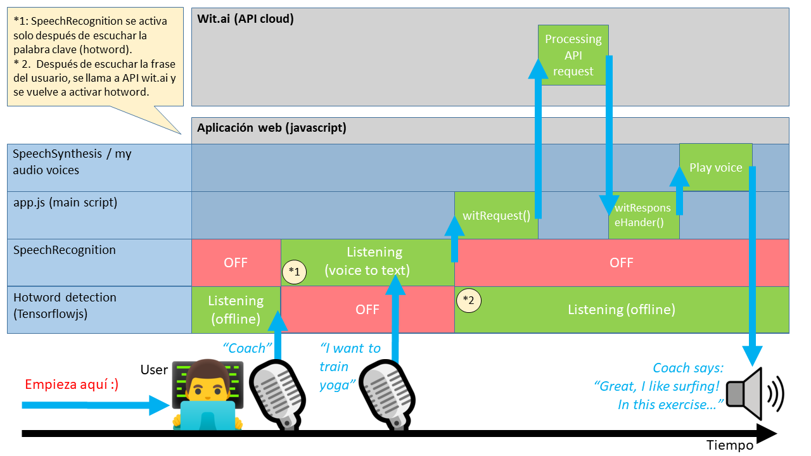
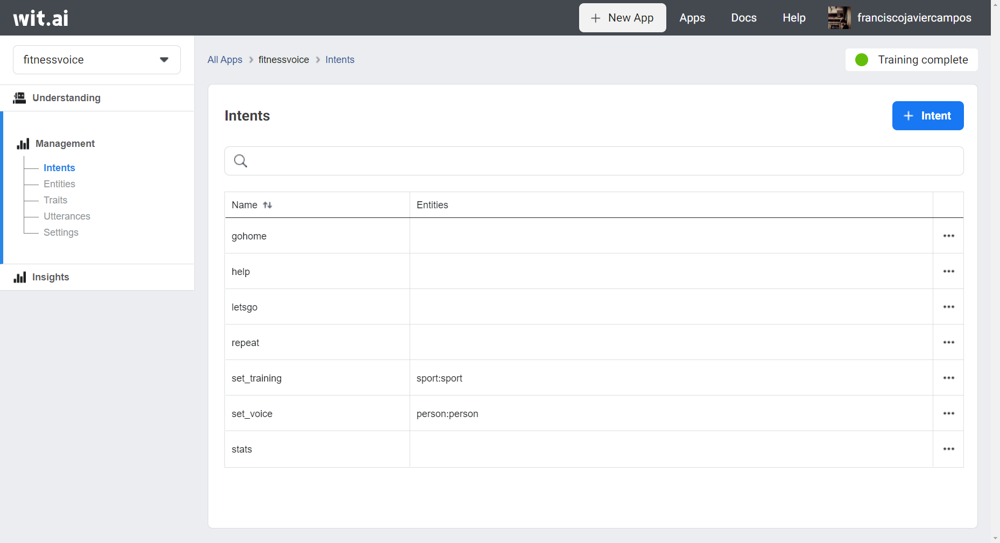
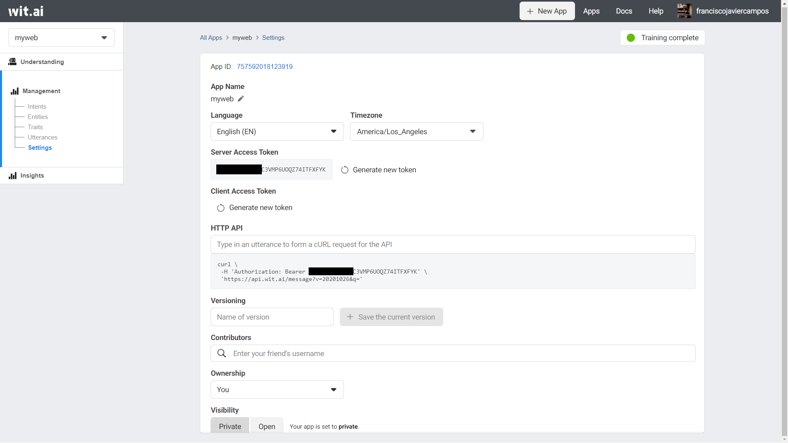

# tutorial-web-voice-control-using-wit

## Objetivo

El objetivo de este tutorial es aprender desde cero a utilizar wit.ai e integrarlo en una aplicación web. Gracias a esto, podremos controlar nuestra aplicación web con la voz. Durante este tutorial se creará paso a paso la aplicación web "Fitness Voice" (<https://github.com/javichur/fitness-voice>). En esta aplicación web, los usuarios pueden utilizar la voz para seleccionar 1 de los 3 entrenamientos disponibles (surfing, gym or yoga). Los usuarios también pueden cambiar la voz del entrenador y pedir ver las estadísticas, por ejemplo.

De forma adicional, este tutorial explica cómo añadir una palabra clave (hotword o wake-word, en inglés), para que la aplicación no esté continuamente escuchando, sino que se despierte al escuchar la palabra especial "coach". Dicha palabra será reconocida offline, sin necesidad de conexión a internet.



Aquí tienes un vídeo de la aplicación web "Fitness Voice", te recomiendo verlo para empezar:

[](https://www.youtube.com/watch?v=b5CAPU8lar4)

## Introducción al diseño para voz

En el diseño de aplicaciones de voz, tienes que tener en cuenta algunas cosas que son diferentes en comparación con las aplicaciones web o aplicaciones móviles:

1. Piensa en todas las acciones diferentes que podrá hacer el usuario. A cada una de estas acciones las llamaremos **intents** (o intenciones, en castellano). Algunos ejemplos de intenciones para nuestra web pueden ser: 'ir a la home', 'mostrar las estadísticas', 'quiero entrenar surfing', etc...

En una aplicación web las acciones suelen estar agrupadas en un menú o en algún otro componente gráfico, de forma que no todas las acciones están visibles a primera vista. Por ejemplo en una tienda online, para poder añadir un producto al carrito primero hay que tener el producto en la pantalla. O para borrar un producto del carrito suele ser común tener que estar en la pantalla del carrito.

Pero en las aplicaciones que se controlan por la voz no es necesario seguir un orden tran estricto como los clics que haríamos en el ejemplo anterior de la web. En el control por voz, usamos el lenguaje natural, mucho más ágil. Por ejemplo, en una tienda online controlada por voz, diríamos directamente "añade manzanas al carrito" (sin buscar antes las manzanas) o "borra las manzanas del carrito" (sin tener que decir antes "muéstrame el carrito actual").

Por tanto, **intenta que en tu aplicación controlada por voz todas las acciones de voz estén siempre disponibles**.

2. A veces las intenciones contienen 1 ó más entidades (**entities** en inglés). Por ejemplo si el usuario dice "quiero practicar surfing" o "quiero practicar yoga", en realidad es la misma intención (hacer entrenamiento), pero dicha intención contiene una identidad "deporte", que puede tomar diferentes valores.

3. Una misma intención se puede expresar con diferentes palabras. Por ejemplo, la intención "stats" puede expresarse con frases como "stats", "muéstrame las estadísticas", "quiero ver las estadísticas", "ver estadísticas por favor". Llamamos **utterances** (o "pronunciación" en castellano) a cada una de estas formas de expresar el mismo intent. Cuando estés diseñando tu modelo de voz, añade todos los ejemplos posibles de utterances, para ser más flexible y que la aplicación entienda a muchos usuarios aunque se expresen con palabras diferentes.

3. **Ayuda al usuario a descubrir qué acciones puede decir.** Muestra en pantalla ejemplos de utterances que pueda decir el usuario. Y si tu web responde con mensajes de voz, puedes usar el truco de terminar las contestaciones al usuario con "... dime por ejemplo 'quiero practicar yoga'" (o el utterance que quieras que diga el usuario).

4. **Nunca dejes de aprender y mejorar.** Por muchos utterances que hayas creado y muchas intenciones (intents) que hayas añadido, los usuarios usarán nuevas expresiones que no tuviste en cuenta y pedirán nuevas acciones en tu aplicación web. No dejes de aprender, como veremos a continuación el panel de <https://wit.ai> muestra estadísticas sobre cómo utilizan los usuarios tu aplicación. Consulta estas estadísticas para conocer nuevos "utterances" que podrás añadir de forma sencilla en tu modelo de voz, para que tu aplicación entienda cada vez mejor a tus usuarios.

## Creación paso a paso de una aplicación en wit.ai

En esta sección vamos a explicar paso a paso cómo crear una app en <https://wit.ai>. Esta aplicacición tendrá diferentes **intents**, **entities** y **utterances**. Puedes repasar estos conceptos en la sección anterior. Una vez que terminemos la app en wit, podremos llamar a dicha app a través de la API de wit. En esta API, enviaremos una cadena de texto (por ejemplo: "quiero practicar yoga") y la API de wit hará el Natural Language Processing (NLP) y nos contestará con el intent y los identities que mejor se corresponden (por ejemplo: intent="set_training" y sport="yoga"). En la siguiente sección veremos cómo llamar a esta API desde una web de forma inteligente, solo llamaremos a la API después de escuchar una palabra clave.

Para empezar, entraremos en la web <https://wit.ai> e iniciaremos sesión.


Una vez logueados, veremos un panel como el siguiente:


Utiliza el **botón New App** para crear tu primera app. Aparecerá un popup como el siguiente:

Rellena el campo "nombre", escoge el idioma de tu app y selecciona la casilla "private". No te preocupes por esto, aunque seleccionemos la casilla "privada", podremos usar nuestra app a través de la API de wit. Puedes elegir el idioma que desees de la lista de idiomas disponibles. A continuación, seguiremos el tutorial


Después de crear la app, aparecerá un menú lateral con las siguientes opciones:

- **Understanding**. Esta es la pantalla que más usaremos. Desde aquí daremos de alta los nuevos "utterances" y los asociaremos a "intents". Seleccionando una o más palabras del "utterance" podremos también definir un "entity".

- **Intents**. Listado de los intents de nuestra app, con información sobre qué "entities" hay en cada intent.

- **Trait**. Se utiliza para obtener rasgos del utterance. Por ejemplo, wit permite obtener rasgos como el sentimiento de la frase (si es positivo, negativo o neutral).

- **Utterances**. Listado de todos los utterances creados. Desde aquí los podemos editar o borrar. Los crearemos desde la sección anterior llamada "understanding".

- **Settings**. Desde aquí podemos obtener el token de acceso para utilizar nuestra app a través de la API de wit.

- **Insights**. Por último, aquí veremos estadísticas de uso de nuestra app: nº de invocaciones, "intents" más usados, etc...

En la siguiente imagen vemos el panel de wit con dicho menú lateral:


Wit es muy sencillo de utilizar. Utilizaremos la pantalla "understanding" (imagen anterior) para la creación de "utterances", "intents" y "entities". Solo accederemos al resto de secciones cuando queramos hacer alguna modificación.

A continuación, vamos a crear nuestro primer "intent". Empezaremos por escribir una frase de ejemplo para dicho intent. Esta frase de ejemplo, como hemos dicho antes, se llama "utterance". Seguimos los pasos de la siguiente imagen:

- 1. Escribir una frase de ejemplo (utterance): "lets go".

- 2. Escribir el nombre del intent al que pertenecerá dicha frase de ejemplo: lo llamaremos "letsgo".

- 3. Pulsar el botón "create intent".


- 4. Pulsar el botón "Train and validate" para guardar el utterance.


La siguiente vez que queramos añadir una frase de ejemplo a este intent, no tendremos que volver a crear el intent sino simplemente seleccionarlo de la lista.

¡Ya hemos creado nuestra primera app NLP por wit! ¿A que ha sido fácil? Si ahora llamamos a la API de wit y le enviamos el texto "lets go", la API nos contestará con: intent="letsgo". Ok, aún no es una app muy útil, pero si continúas leyendo añadiremos más funcionalidad :)

Ahora vamos a crear un nuevo intent, pero esta vez las frases de ejemplo de este intent tendrán una "entity":

- 1. Escribir la frase de ejemplo (utterance): "I want to train surfing".

- 2. Selecciona la palabra "surfing" para crear una "entity".


- 3. La "entity" que crearemos se llamará "sport".


- 4. Crearemos un nuevo intent llamado "set_training" para este utterance (siguiendo los mismos pasos que hicimos con el intent anterior).

- 5. Finalmente guardamos este nuevo utterance pulsando el botón "Train and validate".


Ahora es tu momento de practicar y añadir nuevos utterances para que el modelo NLP entienda mejor a los futuros usuarios.

- Añade nuevos utterances en los intents ya existentes.

- Crea un nuevo intent llamado "stats" para que los usuarios puedan indicar que quieren ver sus estadísticas.

- Crea un nuevo intent llamado "set_voice", que sirva en la aplicación para elegir diferentes voces (pista: necesitarás crear una "entity" en este intent).

- Crea un intent llamado "gohome" para volver al inicio de la aplicación web.

- Crea un intent llamado "help" para dar al usuario más información sobre el funcionamiento de la aplicación.

- También puedes crear un intent llamado "repeat", para repetir el último mensaje que diste al usuario.

Al llegar a este punto, la sección "Intents" de tu app wit debe tener esta apariencia:



Ahora, accede a la sección "settings" para copiar el token que necesitas para utilizar la API:



## Añadir wit y voz en una aplicación web

Para continuar, descarga el código de la aplicación web "Fitness Voice" (<https://github.com/javichur/fitness-voice>). Te servirá de plantilla para poner voz a tus aplicaciones web.

Presta atención a la carpeta `js` de este proyecto, en ella están los ficheros que puedes reutilizar en otras aplicaciones web. Cada fichero sirve para lo siguiente:

- **app.js:** es el script principal de la aplicación web. Desde él se inicializan las variables necesarias, se llama a la API de wit y se procesa la respuesta de dicha API.

- **hotword.js:** es la clase de detectar de forma offline la palabra "coach" cuando la pronuncie el usuario. Para ello, utiliza la librería tensorflowjs. Esta palabra que "despierta" al sistema, se le conoce como "hotword" o "wake-word" en inglés. Puedes entrenar a este modelo para que reconozca otras palabras. La forma más sencilla de entrenarlo es en esta página web: <https://teachablemachine.withgoogle.com/train/audio> . Una vez hayas entrenado al modelo para que reconozca una nueva palabra hotword, deberás descargar el modelo entrenado y guardarlo en `/assets/coach-audio-model`.

- **listenCommand.js:** es la clase encargada de convertir a texto la frase que pronuncia el usuario. Esta clase se activa solo después de que HotWord detecte la palabra "coach". Después de convertir a texto la frase del usuario, se enviará el texto a la API de wit y se volverá a activar el detector de hotword.

- **Settings.js:** en este fichero está la configuración de la aplicación web (el token de API wit, la precisión deseada en la detección de la hotword, el idioma, etc).

- **SoundEffect.js:** aquí está el código que reproduce algunos efectos de sonido, como campanas o aplausos. ¡No todo son palabras en las aplicaciones de voz! :D

- **ui.js:** en este fichero está el código para modificar aspectos visuales de la aplicación web (mostrar las estadísticas, ocultar una pantalla, etc.).

- **Voice.js:** es la clase encargada de sintetizar en voz las frases que queremos decir al usuario.

- **VoiceClone.js:** si el usuario ha pedido cambiar la voz de la aplicación, entonces se usará esta clase, que en lugar de sintetizar cadenas de texto en voz de ordenador, utiliza ficheros mp3 generados por inteligencia artificial y que simulan voces de personajes famosos. Por ejemplo, prueba a decirle a la aplicación "I want to change voice to Bill" y a continuación inicia el entrenamiento diciendo "I want to train surfing". En lugar de escuchar una voz sintética de ordenador, oirás una voz similar a la de una persona famosa.

La técnica utilizada para generar estas voces realistas se llama Voice Cloning y actualmente solo es necesario un audio de muestra de pocos segundos y la cadena de texto que queremos reproducir, para que el sistema recree la voz de forma realista. Puedes obtener más información sobre esto en el siguiente link: <https://github.com/CorentinJ/Real-Time-Voice-Cloning>.

Para terminar, quiero que nos detengamos en el código del fichero `app.js`, en el método `init()` que inicializa la aplicación web, para que veas lo fácil que resulta incorporarlo en tu proyecto:

```javascript
export async function init() {
  UI.initUI();

  // 1. It will run handlerHotwordDetected() when the hotword is detected.
  HotWord.isIdle = true;
  HotWord.handlerHotWordDetected = handlerHotwordDetected;

  await HotWord.createHotwordModelIfNotExists(); // 2. Initialize hotword detection.
  HotWord.listenHotwordOffline();

  // 3. It will run witRequest(message) after listening a right user voice.
  ListenCommand.handlerlistened = witRequest;

  // 4. It will run handlerListenCommandEnd() when listening ends.
  ListenCommand.handlerEnd = handlerListenCommandEnd; // clue: it reactivates hotword detection.

  Voice.selectVoice(Settings.LANG);
  if (isFirstInit) { // 5. Welcome voice message
    Voice.speak('Welcome to Fitness Voice, the AI voice-controlled trainer in your browser.');
    isFirstInit = false;
  }
}

function handlerHotwordDetected() {
  UI.micAnimationPlay();

  try {
    ListenCommand.testSpeech(); // listening the command
  } catch (error) {
    console.log('error handlerHotwordDetected: ' + JSON.stringify(error));
  }
}

function handlerListenCommandEnd() {
  HotWord.isIdle = true; // activate hotword detection again.
  UI.micAnimationPause();
}
```

En el código anterior se está definiendo el funcionamiento que explicábamos al inicio del tutorial (lo recordamos en la imagen siguiente):

- 1. Primero se configura qué hay que hacer si se detecta la palabra "coach" (`HotWord`). Y lo que habrá que hacer si se detecta es escuchar la frase del usuario con la clase `ListenCommand`.

- 2. Después activamos la detección de `HotWord` de forma offline, usando la librería tensorflowjs. Esta detección offline es mucho más eficiente que una detección online, además de tener un enfoque de mayor privacidad para el usuario, ya que nada de lo que el usuario diga será enviado a internet a menos que antes se haya escuchado la palabra reservada "coach".

- 3. Se configura que hay que llamar la API de wit después de escuchar por completo una frase del usuario. Es decir, la clase `ListenComand` terminará llamando a `witRequest`.

- 4. Por último, se volverá a activar la detección de `HotWord`, que había sido desactivada justo después de escuchar la palabra "coach".


Para terminar esta sección, vamos a ver el fragmento de código encargado de llamar a la API de wit y el método encargado de recibir la respuesta y procesarla:

```javascript
function witRequest(message) {
  if (message !== '') {
    $.ajax({
      url: `https://api.wit.ai/message?v=${Settings.WIT_VERSION}&q=${message}`,
      type: 'GET',
      contentType: 'application/json',
      headers: {
        'Authorization': `Bearer ${Settings.WIT_TOKEN}`
      },
      success: function (result) {
        witResponseHander(result);
      },
      error: function (error) {
        alert('error' + JSON.stringify(error));
      }
    });
  }
}

function witResponseHander(result) {
  if (isWitNotUndertand(result)) {
    Voice.speak('I\'m sorry, I can\'t understand. Repeat please.');
    return;
  }

  const intent = result.intents[0];
  switch (intent.name) {
    case 'letsgo':
      witIntentHandlerLetsGo();
      break;
    case 'set_training':
      witIntentHandlerSetTraining(result);
      break;
    case 'help':
      witIntentHandlerHelp();
      break;
    case 'gohome':
      witIntentHandlerGoHome();
      break;
    case 'stats':
      goTo('stats');
      break;
    case 'set_voice':
      witIntentHandlerSetVoice(result);
      break;
    case 'repeat':
      // TODO
      break;
  }
}
```

## Conclusiones

En este tutorial hemos empezado introduciendo puntos que hay que tener en cuenta en el diseño de aplicaciones de voz,

Hemos explicado los conceptos de "utterance", "intent", "entity".

Hemos aprendido desde cero cómo crear una app con wit.ai para tener procesamiento de lenguaje natural (NLP) vía API.

También hemos visto con código fuente de ejemplo, cómo incluir en una aplicación web las llamadas necesarias a wit.ai, así como capacidades para escuchar al usuario de forma eficiente y segura (utilizando una hotword que detectamos offline) y responder al usuario con voz (voz sintética y voz generada con voice cloning).

Espero que os haya gustado :) Puedes enviarme tus comentarios a través de <https://javiercampos.es>.